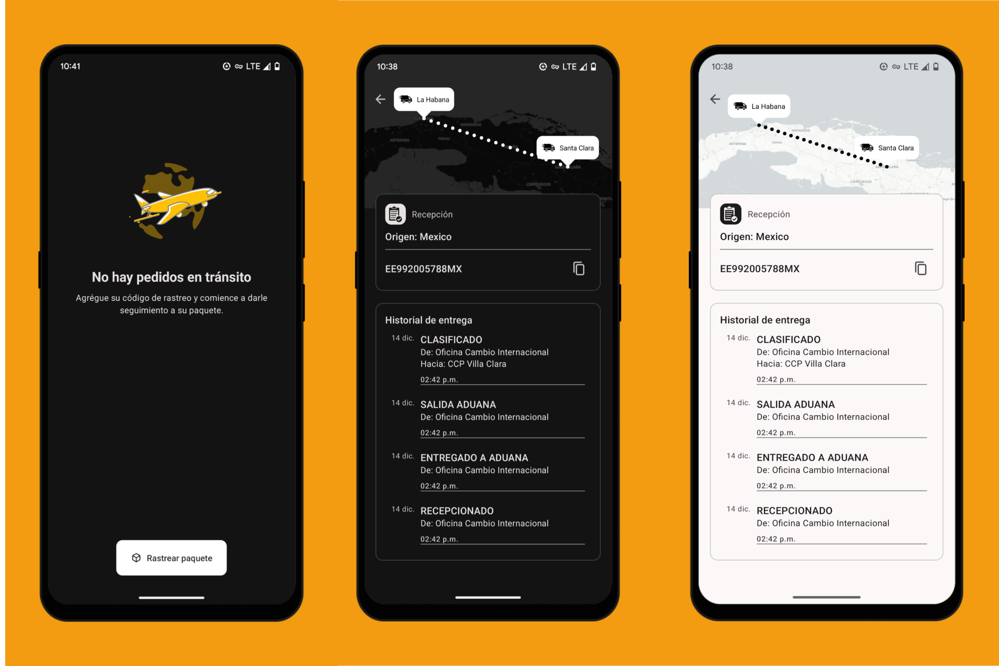

##  En Ruta

Application created to track packages operated by the Cuban Postal Company.

> [!Atention]
>
> En Ruta ni su creador tienen vínculo alguno con Correos de Cuba, sólo se usa su API para rastrear paquetes operados por la empresa.


### App Example 




### License 

```
Copyright [2024] [Alessandro Rodríguez]

   Licensed under the Apache License, Version 2.0 (the "License");
   you may not use this file except in compliance with the License.
   You may obtain a copy of the License at

       http://www.apache.org/licenses/LICENSE-2.0

   Unless required by applicable law or agreed to in writing, software
   distributed under the License is distributed on an "AS IS" BASIS,
   WITHOUT WARRANTIES OR CONDITIONS OF ANY KIND, either express or implied.
   See the License for the specific language governing permissions and
   limitations under the License.
```
